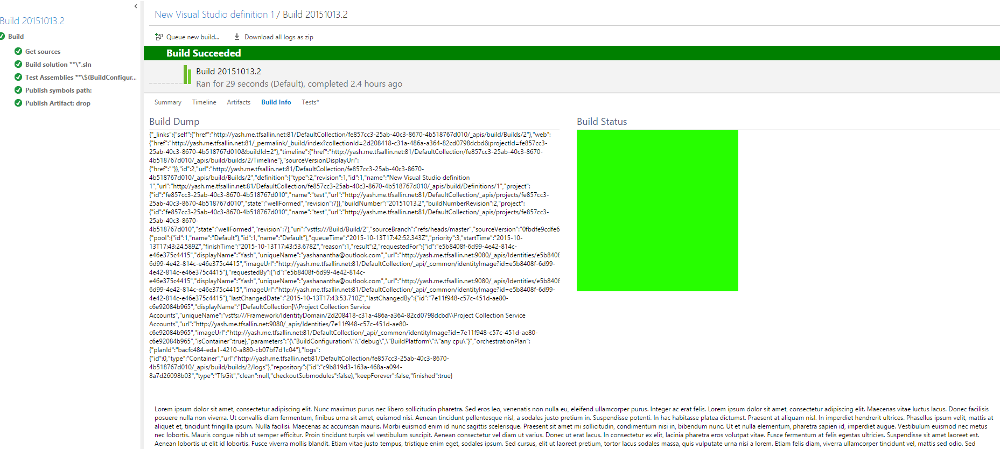
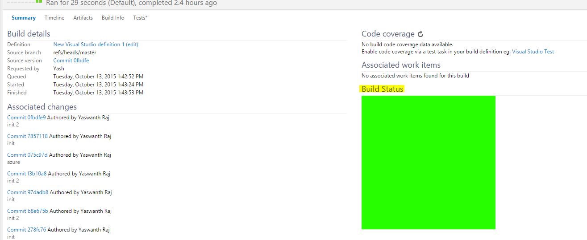
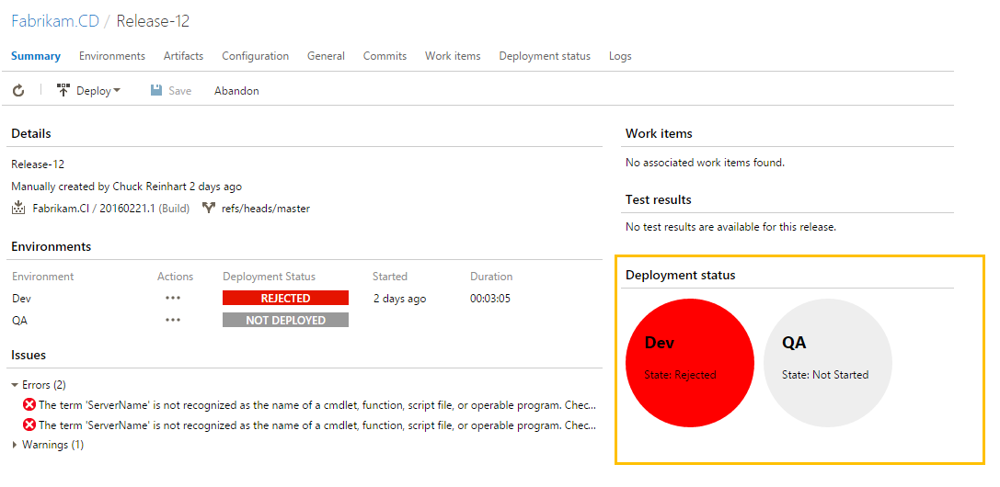
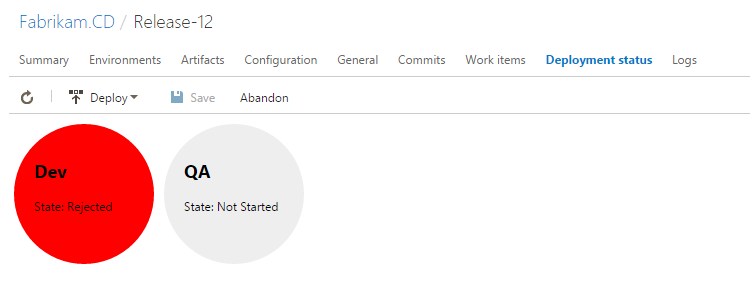

# Visual Studio Team Services (VSTS) Sample Extensions
 
Samples to help jump-start your development of [extensions for Visual Studio Team Services (VSTS)](http://www.visualstudio.com/integrate/extensions/overview).

## Get started

If you plan to package any of the sample extensions, get:

1. [Node.js](https://nodejs.org)
2. [Team Foundation command line interface](https://github.com/Microsoft/tfs-cli) (`npm install -g tfx-cli`)
3. If the extension uses bower (look for bower.json), [Bower](https://npmjs.com/package/bower) (`npm install -g bower`)

If you plan to compile any of the sample extensions, get:

1. TypeScript (`npm install -g typescript`)

### Get the web extension SDK

Each web extension sample has a `bower.json` or `package.json` file, which references third-party libraries used by the sample, including the [Visual Studio Services Web Extension SDK](https://github.com/Microsoft/vss-web-extension-sdk). This SDK JavaScript file is required by all web extensions.

From the directory of the sample, run:

If there is a bower.json file present
```
bower install
```
or if there is only a package.json file present
```
npm install
```

### Compile TypeScript Samples

Once the package is installed, simply run `tsc`. You can alternatively run `npm run build`, which ensures the correct version of the TypeScript compiler is used. This will also generate the extension package.

### Try the extension in Visual Studio Team Services

Most samples can be run without any modifications on [Visual Studio Team Services](https://www.visualstudio.com/products/visual-studio-team-services-vs). The steps are:

1. Create a free [Visual Studio Team Services account](https://app.vssps.visualstudio.com/go/profile?account=true)
1. Create a [Visual Studio Marketplace publisher](https://aka.ms/vsmarketplace-publish) (all extensions are uploaded under a publisher)
1. Verify the extension's manifest file (`vss-extension.json`) either has the `public` attribute set to `false` or is not specified (this ensures your extension is not inadvertently made available to all VSTS users)
1. Package the extension with the ID of your publisher (run `tfx extension create --publisher MYPUBLISHERID`)
1. Upload the produced .vsix file to the [Marketplace](https://aka.ms/vsmarketplace-manage)
1. Share your extension with your VSTS account (right-click on the published extension and select Share)
1. Install the extension into the account (click on the published extension's title and then click Install)

See the [full instructions](https://www.visualstudio.com/docs/integrate/extensions/publish/overview).

## Available samples

### Contributions Guide


See the places where you can extend and enhance the user's web experience with an extension ---- right from within the web experience.

* [Install via the Marketplace](https://marketplace.visualstudio.com/items?itemName=ms-samples.samples-contributions-guide)
 
### Build Inspector

Learn about advanced extension concepts like module loading, using UI controls, history, and more.
 
Note: this sample is written in TypeScript.

### UI


Explore different UI controls, including menus, toolbars, custom controls, and more.

### Public Events (for Team Calendar)

Custom event source for the [Team Calendar extension](https://github.com/Microsoft/vso-team-calendar) for public holidays. 

### Build Results Enhancer

This sample extension shows how to make a tab/section contribution to build summary page, reacting to build updates.

This also has a sample code that allows user to render custom data results uploaded from a particular task in build.

You could contribute to build results view in different ways:
* As a section to any of your own contributed tab for build results view
* As a section to the existing "summary" tab in build results view
* As a tab to the build results view
 
Contributing as a tab and a section to our own tab -



Contributing as a section to "summary" tab -



This sample is written in TypeScript. The compiled JS files are included in the /out directory, but changes will need to be re-compiled. Open readme.txt for instructions.

### Release management extensions
#### Deployment status enhancer
Once this extension is installed, it shows an enhanced view of the deployment status to each environment

This extension showcases 
##### a summary section contribution to Release summary page.



##### a tab contribution to Release summary page.



## Code of Conduct

This project has adopted the [Microsoft Open Source Code of Conduct](https://opensource.microsoft.com/codeofconduct/). For more information see the [Code of Conduct FAQ](https://opensource.microsoft.com/codeofconduct/faq/) or contact [opencode@microsoft.com](mailto:opencode@microsoft.com) with any additional questions or comments.
