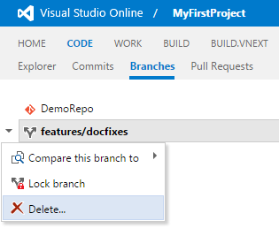

# Visual Studio Online Extension Samples

This repo contains samples to help jump-start you in your development of [Extensions for Visual Studio Online](http://www.visualstudio.com/integrate/extensions/overview).

## Getting started

### Pre-requisites

1. [Join the Visual Studio Partner program](http://www.vsipprogram.com/join) to get early access to the Extensions feature
2. Verify the Extensions feature has been enabled on your account by navigating to ```https://youraccount.visualstudio.com/DefaultCollection/_admin/_apps/hub/ms.vss-extmgmt-web.manageExtensions-collection```.
3. Available local or cloud web server with HTTPS (IIS, Node.js, Azure Web App, Heroku, etc)

### Steps

The samples are published to the gallery. You can install them to your account by doing the following:

1. Go to https://youraccount.visualstudio.com/DefaultCollection/_admin/_apps/hub/ms.vss-extmgmt-web.manageExtensions-collection
2. Locate the sample extension you want to install and click "Install".

#### Publishing the extensions yourself

If you want to edit the samples to play around with them, you will need to publish them yourself.

##### Before you begin
Follow the steps under Before you begin at [Publishing from the Command Line](https://www.visualstudio.com/en-us/integrate/extensions/publish/command-line). Save your Personal Access Token for later use.

##### Publish
1. Clone the samples  
    `git clone https://github.com/Microsoft/vso-extension-samples.git`  
    `cd vso-extension-samples`
    
2. Package and publish an extension  
    `cd <sample>`  
    Note: <sample> is the directory containing the sample you want to publish.
    
    `vset publish --publisher <P> --token <T> --share-with <A> --save`  
    Note: <P> is the ID of the publisher you created in the "Before you begin" steps. <T> is the Personal Access Token you generated in "Before you begin" above. <A> is the name of your VSO account.  
    Note: From now on, if you need to make changes to your manifest and re-publish the extension, you just type `vset publish`. Your token and share options are remembered.  
4. Install by going to https://youraccount.visualstudio.com/_admin/_apps/hub/ms.vss-extensionManagement-web.manageExtensions. Find the extension you published under the Shared With Me category. Click "Install" to install the extension.

## What's available

### Branch delete



Clean up old or unneeded Git branches right from within Visual Studio Online.

### Contribution guide


Discover all the places in Visual Studio Online you can extend, including hubs, toolbars, and context menus, and more.
 
### Build inspector

Demonstrates advanced extension concepts like AMD loading, using UI controls, history, and more. This sample is written in TypeScript and must be built before it can be installed. Open readme.md for instructions.

### UI


Explore different UI controls, including menus, toolbars, custom controls, and more.

### Public events (for Team Calendar)

Adds an event source to the [Team Calendar extension](https://github.com/Microsoft/vso-team-calendar) for public holidays. Note that this sample contributes *to another extension* rather than core Visual Studio Online.

### Build Results Enhancer

This sample extension, written in typescript, shows how to make a tab/section contribution to build summary page, reacting to build updates.

This also has a sample code that allows user to render custom data results uploaded from a particular task in build.

You could contribute to build results view in different ways :
* As a section to any of your own contributed tab for build results view
* As a section to the existing "summary" tab in build results view
* As a tab to the build results view
 

Contributing as a tab and a section to our own tab -


Contributing as a section to "summary" tab -


