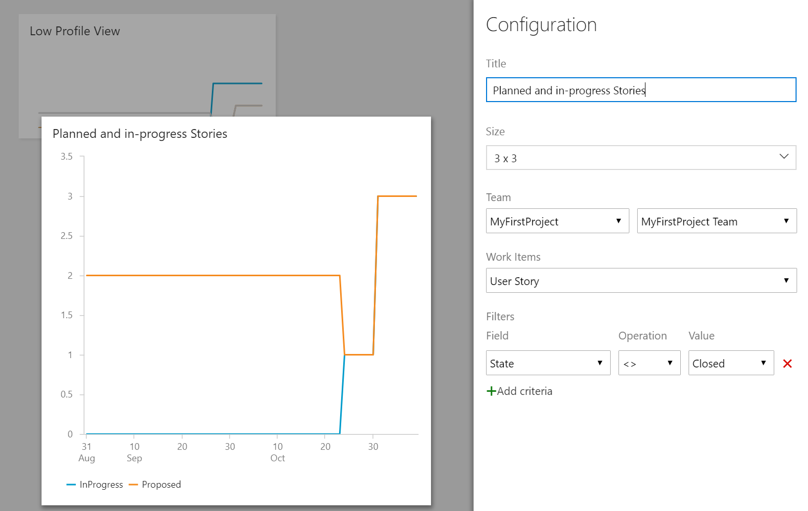

# Introduction 
The purpose of this example is to provide a working VSTS Widget Extension, exercising Charting and Analytics data, implemented in Typescript with a React UI model. It provides a configurable trend chart against work item tracking data, scoped to a project, team, work item type, with support for custom filtering of results.




# Getting Started
From this directory:

1. (Command Line: Set up your environment) 
```
npm install
npm install -g typescript
```
2. Override the publisher in vss-extension.json with your publisher Id. [Learn to create a publisher](https://docs.microsoft.com/en-us/vsts/extend/publish/integration?view=vsts#steps
)
3. (Command Line: Build your extension) `tsc`
3. (Command Line: Create your extension) `.\node_modules\.bin\tfx extension create --manifest-globs vss-extension.json --rev-version`
4. Publish your extension from Marketplace 
5. Share your extension to your test VSTS account
6. Install the widget: from your VSTS account, click "Manage Extensions", select "Analytics example widget" and "Install" it

# More Information
See our [documentation page](https://docs.microsoft.com/en-us/vsts/report/extend-analytics/example-analytics-widget) for more pointers on [Analytics](https://docs.microsoft.com/en-us/vsts/report/extend-analytics/), [Widgets](https://docs.microsoft.com/en-us/vsts/report/dashboards/index) and [Charting](https://docs.microsoft.com/en-us/vsts/extend/develop/add-chart).