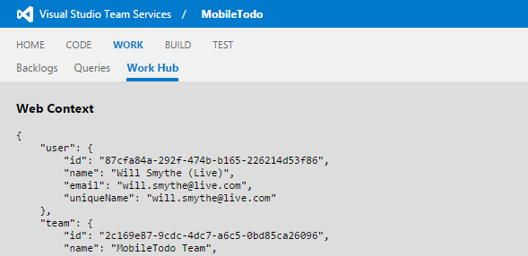
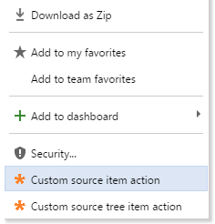
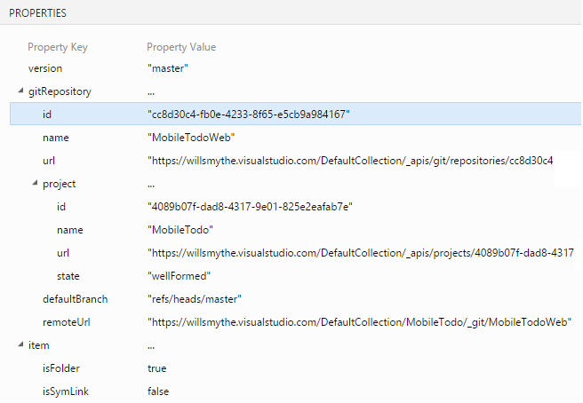

This extension is designed to help extension developers discover the various components of Visual Studio Team Services that can be targeted by contributions from third party extensions, as well as the context data that is available at each target.

[Learn more](https://www.visualstudio.com/docs/integrate/extensions/reference/targets/overview) about the supported extensibility targets.

## See where you can extend

Instantly see available extensibility targets: hub groups, context menus, and others.

#### Hubs

#### Menus and more

## Real context information

Click a contributed hub, menu item, toolbar button, etc to see details about the contribution target, including context information that is made available to your extension's JavaScript code.

