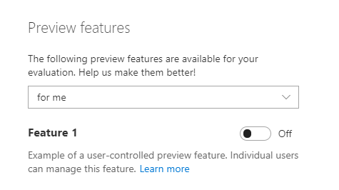
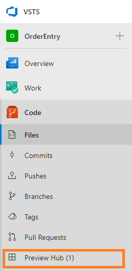
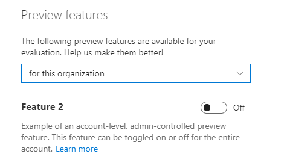
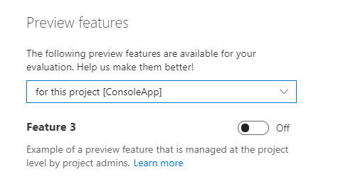
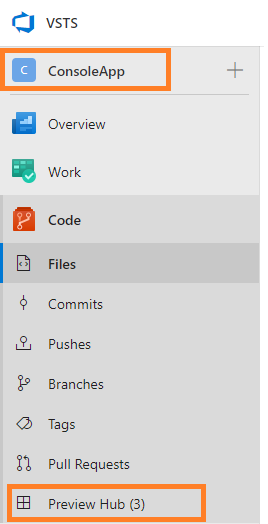
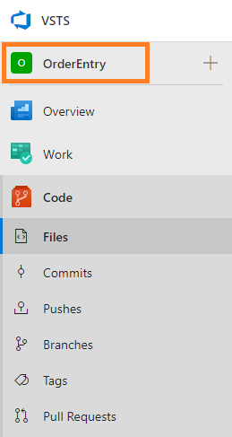

# VSTS preview features sample

This sample demonstrates how you can give admins and users the ability to control the visibility of some or all of your extension's contributions. As an extension developer, you might want to do this if:

1. You want to make users "opt in" to use a new feature you are developing

2. You need to dev/test your extension in a production organization without impacting other users

3. Your users are asking for the ability to hide parts of your extension from certain users or projects

To learn about how users and admins manage preview features, see [Enable preview features](https://docs.microsoft.comvsts/project/navigation/preview-features?view=vsts&tabs=new-nav).

## How to contribute a preview feature

Preview features are contributions that get defined in an extension manifest like any other contribution. Other contributions can then be "constrained" by the feature, meaning they are only visible when the preview feature is enabled (i.e. toggled on).

Here are the steps for defining a preview feature that controls the visibility of other contributions:

1. Define a preview feature contribution. For example:
   ```json
   {
        "id": "my-feature",
        "type": "ms.vss-web.feature",
        "description": "Controls ",
        "targets": [ "ms.vss-web.managed-features" ],
        "properties": {
            "name": "My Feature",
            "userConfigurable": true,
            "hostConfigurable": false
        }
   }
   ```

2. Use the `userConfigurable`, `hostConfigurable`, and optionally the `hostScopes` properties to control whether your feature can be controlled by individual users and/or by admins for the entire organization or just individual projects. See below for examples.

3. Set `constraints` on any contribution you want contolled by your preview feature. For example:
   ```json
   {
        "id": "my-hub",
        "type": "ms.vss-web.hub",
        "targets": [
            "ms.vss-code-web.code-hub-group"
        ],
        "properties": {
            "name": "My Hub",
            "uri": "hub.html"
        },
        "constraints": [
            {
                "name": "Feature",
                "properties": {
                    "featureId": "my-publisher.my-extension.my-feature"
                }
            }
        ]
   }
   ```

## Examples

These examples demonstrate different options for controlling who can manage your preview feature.

### Example 1: Controlled by each user

In this example, each user gets to control the state of the feature. When a user toggles the feature on or off, only that user is impacted.



This user (and any other user that also enabled the feature) will see the "Preview Hub (1)" hub:




### Example 2: Controlled for the entire organization

In this example, organization admins get to control the state of the feature for the entire organization.



All users in the organization will now see the "Preview Hub (2)" hub in every project.

### Example 3: Controlled for each project

In this example, project (and organization) admins get to control the state of the feature for individual project. This is useful in large organizations where an extension is only applicable to a subset of projects.



When a project admin enables the feature for their project (ConsoleApp in this example), the hub controlled by the feature is visible to all users working in that project:



If the same user navigates to a different project (OrderEntry) where the feature has not been enabled, the hub will not be visible:



## How to run this sample

1. Install required tools (Node.js and TFX CLI)

2. Run `npm install` from the `preview-features` directory to install the VSS Web Extension SDK

3. Find and replace `ms-samples` (the publisher ID) in the extension manifest file (`vss-extension.json`) with your own publisher ID

4. Package, publish, share, and install the extension

For more details on these steps, see [Develop a web extension for VSTS](https://docs.microsoft.com/en-us/vsts/extend/get-started/node)

