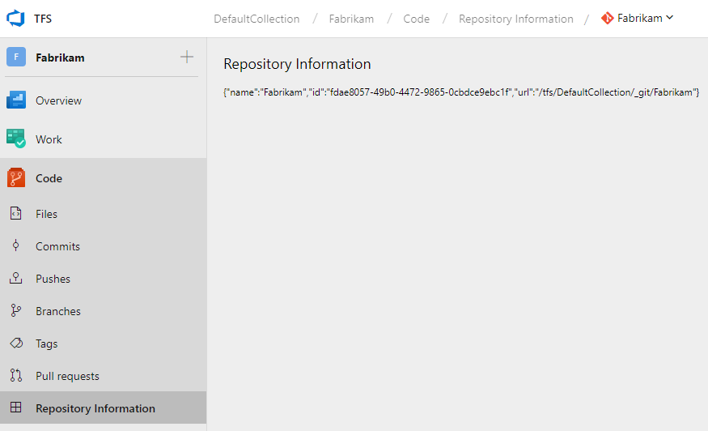

This extension is an example of how to access information about the user's currently selected repository from an extension. Note: this information will only be accessible on pages that are within the "code" hub, including new pages that may be added by the extension (as in this example).

## Building

This extension is built using NodeJS with the [typescript](https://github.com/Microsoft/TypeScript) and [tfs-cli](https://github.com/Microsoft/tfs-cli) packages. Once those are installed, open a command prompt at the extension's root and run:

1. `npm install`
2. `tsc`
3. `tfx extension create`

## Screenshot

