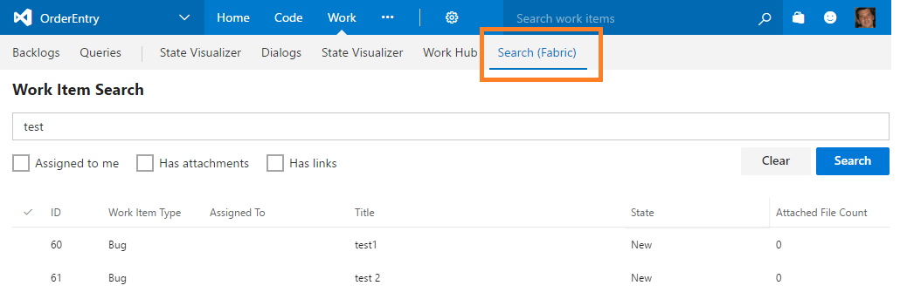

# Visual Studio Team Services Office UI Fabric React Sample

A sample extension for Visual Studio Team Services that is built with [React](https://facebook.github.io/react/) and [Office UI Fabric React](http://dev.office.com/fabric#/components) components.

It uses components like TextField, Button, Checkbox and DetailsList to search for work items and list the results.

## How to 

NOTE: This extension is meant to help  developers learn about developing web extensions. It does not directly provide a lot of value from a user perspective. 

If you are a developer, learn how to [build, package, and extend](./building.md) this sample extension.

